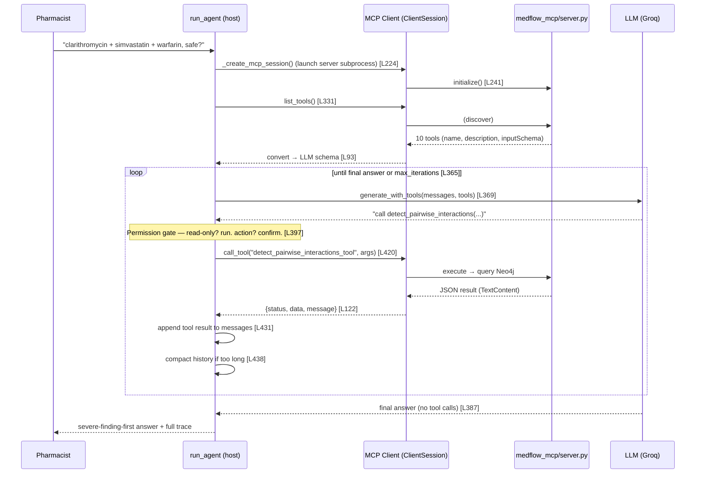

# Deep-Dive Study Guide — Model Context Protocol (MCP)

> **Goal:** understand MCP well enough to explain, from memory, exactly what your own [agent/loop.py](../agent/loop.py) does when it answers a pharmacist's question — and *why* it's built that way. This is the one Week-5 topic you can't fake by reading existing code, because it's a protocol, not just a function.
>
> **Read this alongside the code.** Every concept below points to the exact lines in *your* repo where it lives. Open `agent/loop.py` and `medflow_mcp/server.py` side by side.

---

## 1. The one big idea

Before MCP, if you wanted an LLM to use a tool, you hardwired that tool into your app. Every app re-implemented every tool. MCP flips it:

> **Tools live in a *server*. Any *client* can connect to that server, ask "what tools do you have?", and call them — over a standard protocol.**

Three roles (this is exactly what your first video, *"MCP Server vs MCP Host vs MCP Client"*, is about):

| Role | What it is | In MedFlow |
|---|---|---|
| **Server** | A process that *exposes* tools/resources/prompts | [medflow_mcp/server.py](../medflow_mcp/server.py) — the 10 clinical tools |
| **Client** | Code that *connects* to one server and calls its tools | The MCP session inside [agent/loop.py](../agent/loop.py) (`_create_mcp_session`, L224) |
| **Host** | The app that *owns* the LLM and manages one-or-more clients | `run_agent()` / your agent loop as a whole (Claude Desktop is another host) |

**Why this matters for your project specifically:** because the tools are a *server*, the future **Doctor Agent** can connect to the *same* server and get the *same* safety checks — for free, with no shared code. That's the "reusable medical intelligence layer" idea. You are not building a chatbot; you're building a service with a standard plug.

> **Self-check ①:** In one sentence each — what's the difference between the server, the client, and the host in MedFlow? If you can't answer without looking, re-read this section.

---

## 2. The four things MCP actually does

A client only ever needs four concepts. Learn these and you know MCP.

### (a) Transport — *how* bytes move between client and server
MedFlow uses **stdio**: the client **launches the server as a subprocess** and talks to it over stdin/stdout. No network, no ports. (The other transport is HTTP/SSE, for remote servers — you're not using it yet.)

→ In your code: [agent/loop.py:235-238](../agent/loop.py#L235-L238)
```python
params = StdioServerParameters(
    command=sys.executable,        # "python"
    args=[_MCP_SERVER_PATH],       # ".../medflow_mcp/server.py"
)
```
This literally means: *"run `python medflow_mcp/server.py` and pipe to it."* That's why the server ends with `mcp.run(transport="stdio")` — it sits in a loop reading stdin.

### (b) Initialize — the handshake
Before anything, client and server exchange capabilities and protocol version. One call.

→ [agent/loop.py:239-242](../agent/loop.py#L239-L242)
```python
read, write = await stdio_client(params).__aenter__()
session = await ClientSession(read, write).__aenter__()
await session.initialize()          # ← the handshake
```

### (c) list_tools — **discovery** (the heart of the week)
The client asks the server what tools exist. **The agent does not know its tools in advance** — it learns them at runtime. This is the single most important line in the whole loop:

→ [agent/loop.py:331](../agent/loop.py#L331)
```python
tools_result = await session.list_tools()      # server replies with all 10 tools
```
Each tool comes back with `name`, `description`, `inputSchema`. But the LLM's function-calling API wants `name`, `description`, `parameters` — so you *translate*:

→ `_convert_mcp_tools_to_llm_schema`, [agent/loop.py:93-119](../agent/loop.py#L93-L119)

Notice it also **strips the `_tool` suffix** (L108-110): the server names them `resolve_drug_name_tool`, but the LLM sees the clean `resolve_drug_name`. Remember this — it's why there's a name-mapping table (next).

### (d) call_tool — invocation
The client sends `name + arguments`; the server runs the function and returns a result.

→ [agent/loop.py:420](../agent/loop.py#L420)
```python
mcp_result = await session.call_tool(mcp_name, arguments)
```
Two subtleties your team handled:
- **Name mapping back to the server's name** (`_SHORT_TO_MCP_NAME`, [L35-46](../agent/loop.py#L35-L46)): the LLM said `resolve_drug_name`, but the server tool is `resolve_drug_name_tool`, so you map before calling (L417).
- **Result unwrapping** (`_convert_mcp_result`, [L122-156](../agent/loop.py#L122-L156)): MCP returns a `CallToolResult` with a list of content blocks; MedFlow's tools return a JSON string inside one `TextContent`, so you `json.loads(result.content[0].text)` and normalise to `{status, data, message}`.

> **Self-check ②:** Name the four MCP operations and what each returns. Which one makes the agent "discover" tools instead of hardcoding them?

---

## 3. The full lifecycle — trace it end to end

This is the mental movie you should be able to replay. Here it is as a sequence, mapped to your code:



Walk it once out loud. If any arrow is fuzzy, that's the section to re-read.

> **Self-check ③:** After `list_tools` returns, the loop calls the LLM. What two things does the LLM get in that call, and what are the two possible shapes of its reply?

---

## 4. The parts that are genuinely tricky (understand these, they're where bugs live)

Your instructor wants understanding, not just "it runs." These three are the real learning:

1. **Async / subprocess lifecycle.** The client is `async` (`await session.call_tool(...)`) because it's talking to a subprocess over pipes; `run_agent` bridges sync→async with `asyncio.run()` ([L263](../agent/loop.py#L263)). The session is opened once per `run_agent` call and torn down in a `finally` ([L309-315](../agent/loop.py#L309-L315)). **Question to sit with:** is opening a fresh subprocess *per question* efficient? What would you change for a server handling many requests? (This is a great thing to raise with your instructor.)

2. **Name & schema translation is not cosmetic.** The LLM's tool vocabulary (`resolve_drug_name`) and the server's (`resolve_drug_name_tool`) are two different namespaces bridged in two places ([L108-110](../agent/loop.py#L108-L110) stripping, [L417](../agent/loop.py#L417) mapping back). If discovery and invocation disagree on names, tool calls fail silently. Understand *why both directions exist*.

3. **Result unwrapping.** MCP is generic — it doesn't know your tools return JSON. `_convert_mcp_result` ([L122](../agent/loop.py#L122)) is the seam between "MCP's generic envelope" and "MedFlow's `{status,data,message}` shape." This is where a malformed tool response would surface.

> **Bonus (permissions + context, since they're in the same file):** the permission gate ([L397-414](../agent/loop.py#L397-L414)) sits *between* the LLM asking for a tool and the client calling it — read-only tools pass, `action` tools hit `require_confirmation`. Context compaction ([L159-219](../agent/loop.py#L159-L219)) runs *after* each round of tool results, collapsing old turns into a summary once history passes 12 messages. Both are Week-5 concepts already wired in — study them the same way: find where they sit in the loop and why *there*.

---

## 5. Read the docs in this order

Don't read everything — read these, in this order, and log each in your Learning Log:

1. **Concept first (video, you've watched):** *"MCP Server vs Host vs Client"* → gives you §1.
2. **Official intro:** `modelcontextprotocol.io` → *Introduction* + *Core concepts → Tools*. Confirms §2.
3. **The client quickstart:** `modelcontextprotocol.io` → *For Client Developers* (Python). This is the exact pattern your `_create_mcp_session` implements — read it and diff it against your code.
4. **Python SDK source/examples:** `github.com/modelcontextprotocol/python-sdk` → the `ClientSession` + `stdio_client` examples. See where your team's manual `__aenter__()` differs from the SDK's `async with` pattern (a real, discussable design choice — see §4.1).
5. **The spec (skim, don't memorise):** `modelcontextprotocol.io/specification` → just the *lifecycle* and *tools* pages, to see the actual JSON-RPC messages behind `initialize`/`list_tools`/`call_tool`.
6. **Why it exists (context):** Anthropic's *"Introducing the Model Context Protocol"* announcement.

---

## 6. Prove you understand it (hands-on)

Do these — they convert reading into knowing:

1. **See the tools without the agent.** Run the MCP Inspector against your server:
   ```bash
   docker compose up -d          # tools query Neo4j
   mcp dev medflow_mcp/server.py # opens a web GUI
   ```
   Click each tool, read its auto-generated schema, call one by hand. *This is `list_tools` + `call_tool` with a GUI instead of your loop.*

2. **Watch discovery happen.** Temporarily add a `print(tools_schema)` after [L333](../agent/loop.py#L333) and run one question. You'll see the exact 10 tools the LLM receives — proof the agent learned them at runtime, not from a hardcoded list.

3. **Break the name mapping on purpose.** Change one entry in `_SHORT_TO_MCP_NAME` to a wrong name, run a question that needs it, and read the error. Now you understand *why* the mapping exists. Put it back.

4. **Explain it to a teammate** without notes, using the §3 sequence. If you can, you've got it.

---

## 7. Self-check questions (answer cold before you call this "done")

1. What does "the agent discovers its tools" mean, mechanically? Which line?
2. Why is the client code `async` when the query functions themselves are plain sync Python?
3. Why does the server suffix tools with `_tool` and the loop strip it? What breaks if the two sides disagree?
4. Where exactly does the permission gate sit relative to `call_tool`, and why *there* and not earlier or later?
5. If you pointed the future Doctor Agent at this same server, what code would you have to share? (Answer: none — that's the whole point.)
6. What's one thing about the current async/subprocess lifecycle you'd want to improve for production, and why?

If you can answer all six from memory, you've mastered the week's centerpiece.
