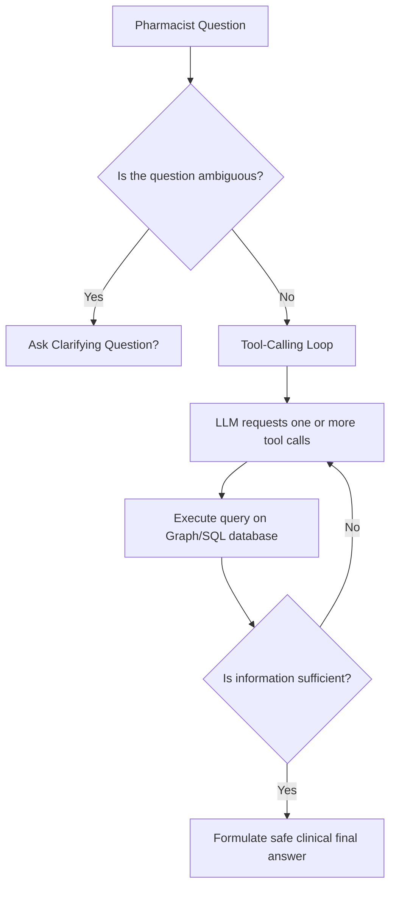

# MedFlow — Presentation Guide (Agent & MCP Server)

This document summarizes the architecture, technical achievements, and recent optimizations of **MedFlow**. It is structured to help you present and explain your work to your teacher.

---

## 1. Project Overview
**MedFlow** is an intelligent pharmacological safety assistant. It combines the reasoning capabilities of LLMs with the factual safety data of a hybrid knowledge base to detect clinical risks during drug prescriptions.

### Hybrid Database Architecture:
* **Relational Layer (PostgreSQL):** Stores dynamic patient data (medical charts, active prescriptions, audit logs).
* **Graph Knowledge Layer (Neo4j):** Models complex clinical relationships:
  * `(Molecule)-[:BELONGS_TO]->(DrugClass)`
  * `(Molecule)-[:INTERACTS_WITH {severity: "major"}]->(Molecule)`
  * `(Molecule)-[:METABOLIZED_BY]->(CYPEnzyme)`
  * `(Molecule)-[:CONTRAINDICATED_FOR]->(Condition)`
  * `(Molecule)-[:CROSS_REACTS_WITH]->(AllergyGroup)`

---

## 2. Week 4: The Autonomous Agent (Tool-Calling)
Unlike classic GraphRAG pipelines (which execute rigid, hardcoded database queries before feeding text to the LLM), the **MedFlow Agent** delegates control to the LLM to query the database dynamically.

### Agent Loop Workflow:


### The 10 Safety Tools Exposed to the Agent:
1. `resolve_drug_name`: Resolves brand names (e.g., Tahor) to canonical active molecules (e.g., atorvastatin).
2. `get_drug_profile`: Returns full technical properties of a drug.
3. `detect_pairwise_interactions`: Searches direct drug-drug interactions recorded in the graph.
4. `detect_cyp_competition`: Detects indirect, enzyme-mediated interaction risks (CYP450).
5. `check_contraindications`: Validates drugs against the patient's existing diseases (conditions).
6. `check_allergy_conflict`: Checks for direct allergies and class cross-reactivities (e.g., penicillins vs cephalosporins).
7. `check_therapeutic_duplication`: Detects duplicate drug therapies (e.g., prescribing two statins at once).
8. `check_dose_appropriateness`: Checks dose flags based on age, weight, and lab metrics (creatinine, eGFR, liver enzymes).
9. `get_drugs_by_class`: Lists alternative treatments belonging to the same drug class.
10. `full_prescription_check`: A consolidated check executing all safety checks in a single call.

---

## 3. Week 5: The MCP Server (Model Context Protocol)
The **Model Context Protocol** (developed by Anthropic) is an open standard allowing secure data and tool sharing with AI assistants (such as Claude Desktop).

### MedFlow MCP Integration:
* **Standardized Server (`medflow_mcp/server.py`):** Exposes graph query engines as standardized MCP tools.
* **Claude Desktop Integration:** Allows the desktop Claude app to query your local Neo4j database live during standard chat sessions.
* **Web UI Debugger (MCP Inspector):** Runs via `mcp dev` to visually test tools, check parameters schemas, and inspect JSON payloads.

---

## 4. How to Address Teacher's Feedback: Showcasing Single-Tool Execution
During your last review, your teacher asked you to **show that the chatbot can run with exactly one tool call**. 

### Why the Teacher Asked This:
They wanted to verify that the agent is efficient, avoids redundant database queries, and is smart enough to stop after the very first step when a single query is sufficient to answer the question.

### How to Showcase it Live:
To prove this, run a targeted query where only a single piece of information is needed from the graph:

#### Scenario 1: A brand name resolution or identity check
* **Question:** *"Is Tahor the same drug as atorvastatin?"*
* **What happens:** The agent only needs to resolve the brand name `Tahor` to see if it matches `atorvastatin`. It calls `resolve_drug_name` and stops immediately.
* **How to show the trace proof:**
  Run this command in PowerShell to print the execution trace:
  ```powershell
  python -c "from agent import run_agent, pretty_print; r = run_agent('Is Tahor the same drug as atorvastatin?'); print(pretty_print(r['trace']))"
  ```
  **Point out the proof in the output:**
  * Show that `iterations` is exactly `1`.
  * Show that `steps` has exactly one entry calling `resolve_drug_name`.

#### Scenario 2: A simple pairwise drug interaction
* **Question:** *"Are there any interactions between warfarin and aspirin?"*
* **What happens:** The agent only needs to check direct interactions. It calls `detect_pairwise_interactions` and immediately returns the answer.
* **Execution Trace Proof:**
  ```powershell
  python -c "from agent import run_agent, pretty_print; r = run_agent('Are there any interactions between warfarin and aspirin?'); print(pretty_print(r['trace']))"
  ```
  * Show that the agent executes exactly **one turn** (calls `detect_pairwise_interactions`) and halts.

---

## 5. Recent Improvements & Optimizations
We recently audited and polished the codebase to achieve 100% correct behavior:

* **Robust Prescription Logic (Optional Parameters):** Updated `full_prescription_check` across agent tools ([agent/tools.py](file:///c:/Users/bahab/OneDrive/Desktop/medflow/agent/tools.py#L229)) and the MCP schema ([medflow_mcp/server.py](file:///c:/Users/bahab/OneDrive/Desktop/medflow/medflow_mcp/server.py#L124)) to make the `prescription` argument optional. This allows the model to review a patient's active drug charts without crashing.
* **Bilingual LLM Language Control:** Tuned the system prompt addendum ([agent/system_prompt_addendum.txt](file:///c:/Users/bahab/OneDrive/Desktop/medflow/agent/system_prompt_addendum.txt)) by shifting English output requirements to the `IDENTITY` block. This prevents the local Qwen model from writing Chinese terms or freezing outputs into raw JSON.
* **Type-Safety Protections:** Fixed a crash in the renal/hepatic dose checker (`query/safety.py`) caused by unmeasured, `NoneType` lab values.
* **Graph Database Additions:** Loaded cephalosporin cross-reactivity and metformin renal contraindications in both Neo4j and Postgres.

---

## 6. Final Evaluation Metrics
* **Python Unit Tests:** **100% passing (127/127)**.
* **MCP Server Tests:** **100% passing (15/15)**.
* **Agent Evaluation (25 Scénarios):** **100% passing (25/25)** (Multi-tool: 10/10, Ambiguity: 7/7, Adversarial: 8/8).
* **GraphRAG Chatbot Evaluation (30 Cas):** **100% passing (30/30)**.
