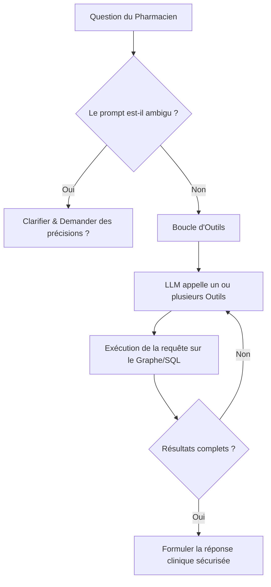

# MedFlow — Guide de Présentation (Agent & Serveur MCP)

Ce document résume l'architecture, les réalisations techniques et les optimisations récentes de **MedFlow**. Il est structuré pour servir de support à votre présentation devant votre enseignant.

---

## 1. Vue d'Ensemble du Projet
**MedFlow** est un assistant de sécurité pharmacologique intelligent. Il combine la puissance de raisonnement des LLM avec la rigueur factuelle d'une base de connaissances hybride pour détecter les risques lors de la prescription de médicaments.

### Architecture de Données Hybride :
* **Base Relationnelle (PostgreSQL) :** Stocke les données dynamiques des patients (dossiers médicaux, historique de prescription, logs d'utilisation).
* **Graphe de Connaissances (Neo4j) :** Modélise les relations cliniques complexes :
  * `(Molecule)-[:BELONGS_TO]->(DrugClass)`
  * `(Molecule)-[:INTERACTS_WITH {severity: "major"}]->(Molecule)`
  * `(Molecule)-[:METABOLIZED_BY]->(CYPEnzyme)`
  * `(Molecule)-[:CONTRAINDICATED_FOR]->(Condition)`
  * `(Molecule)-[:CROSS_REACTS_WITH]->(AllergyGroup)`

---

## 2. Semaine 4 : L'Agent Autonome (Tool-Calling)
Contrairement aux pipelines GraphRAG classiques (qui exécutent des requêtes figées en amont), l'**Agent MedFlow** donne le contrôle au LLM pour interroger dynamiquement la base de connaissances.

### Fonctionnement de la Boucle d'Agent :

### Les 10 Outils Exposés à l'Agent :
1. `resolve_drug_name` : Résout un nom commercial (ex: Tahor) en sa molécule active (ex: atorvastatine).
2. `get_drug_profile` : Retourne la fiche technique complète d'une molécule.
3. `detect_pairwise_interactions` : Recherche d'interactions directes enregistrées dans le graphe (ex: ANSM).
4. `detect_cyp_competition` : Identifie les risques indirects (compétition enzymatique sur le CYP450).
5. `check_contraindications` : Vérifie l'adéquation d'une molécule par rapport aux maladies (conditions) du patient.
6. `check_allergy_conflict` : Vérifie les allergies directes ou croisées (ex: pénicilline vs céphalosporines).
7. `check_therapeutic_duplication` : Détecte les doublons thérapeutiques (ex: deux statines prescrites en même temps).
8. `check_dose_appropriateness` : Valide la dose selon l'âge, le poids et les données biologiques (créatinine, eGFR, ALT/AST).
9. `get_drugs_by_class` : Récupère les alternatives thérapeutiques appartenant à une même classe de médicaments.
10. `full_prescription_check` : Exécute de manière consolidée l'ensemble des 9 requêtes ci-dessus en un seul appel.

---

## 3. Semaine 5 : Le Serveur MCP (Model Context Protocol)
Le **Model Context Protocol** (créé par Anthropic) est un standard ouvert permettant d'exposer des données et des outils sécurisés à des assistants IA (comme Claude Desktop).

### Intégration MedFlow MCP :
* **Serveur standardisé (`medflow_mcp/server.py`) :** Expose les moteurs de requêtes du graphe sous forme d'outils et de ressources MCP standardisés.
* **Intégration Claude Desktop :** Permet à l'application Claude d'interroger en temps réel votre base de données locale Neo4j lors d'un chat clinique normal.
* **Outil d'inspection (MCP Inspector) :** Une interface de debug web (`mcp dev`) qui permet de visualiser le schéma des outils, d'exécuter des tests manuels et de monitorer les payloads JSON.

---

## 4. Améliorations & Optimisations Récentes (Crucial pour l'Oral !)
Récemment, nous avons mené une phase d'audit et de correction de bugs pour rendre le système robuste à 100%. Voici les points techniques clés à présenter :

### A. Rendre l'évaluation de prescription robuste (Argument `prescription` optionnel)
* **Problème :** L'outil `full_prescription_check` imposait le paramètre `prescription` comme obligatoire dans son schéma JSON. Lorsque l'agent voulait faire une simple réévaluation de l'ordonnance active d'un patient sans ajouter de nouveau médicament, le serveur MCP ou le validateur d'arguments plantait.
* **Résolution :** Nous avons rendu l'argument `prescription` **optionnel** (dans le code métier, le validateur de l'agent, et la déclaration du serveur MCP). Désormais, si `prescription` est omis ou vide, le système réalise une évaluation de sécurité globale sur les seuls médicaments actifs existants du patient (`patient_meds`), rendant le système parfaitement flexible.

### B. Fiabilité linguistique du LLM (Éviter les blocages et les caractères chinois)
* **Problème :** Le modèle de langage local (`qwen2.5:7b-instruct`) est bilingue (anglais/chinois). Face à des termes médicaux complexes ou sous des contraintes trop strictes de prompt, il générait parfois des réponses en caractères chinois (ex: 肾功能不全 au lieu de "renal impairment") ou figeait sa sortie en affichant directement du code JSON brut au lieu de texte libre.
* **Résolution :** Nous avons restructuré l'addendum du prompt système ([agent/system_prompt_addendum.txt](file:///c:/Users/bahab/OneDrive/Desktop/medflow/agent/system_prompt_addendum.txt)) :
  * Déplacé les règles de langue au niveau de la définition de son rôle (`IDENTITY`).
  * Enforcé l'obligation d'écrire exclusivement en anglais et interdit l'affichage de caractères chinois, sans surcharger les sections de formatage de code. Le modèle répond désormais de manière stable et naturelle en anglais.

### C. Gestion robuste des données manquantes (`NoneType` safety)
* **Problème :** L'analyseur biologique de dose (`check_dose_appropriateness`) plantait avec une erreur Python `TypeError: '>' not supported between instances of 'NoneType' and 'int'` lorsque le dictionnaire biologique contenait des valeurs `null` (ex: taux de créatinine non mesuré).
* **Résolution :** Implémentation d'un helper d'extraction sécurisé (`_get_val`) dans `query/safety.py` pour gérer proprement les valeurs absentes ou `None` en retournant des valeurs par défaut non bloquantes.

### D. Complétion des arêtes du graphe clinique
* **Allergie Céphalexine/Pénicilline :** Ajout de la liaison manquante entre la molécule `cephalexin` et le groupe d'allergie des céphalosporines dans Neo4j et Postgres, permettant de lever une alerte d'allergie croisée en cas d'allergie documentée à la pénicilline.
* **Contre-indication Metformine/IRC 4 :** Ajout de la relation de contre-indication directe `CONTRAINDICATED_FOR` dans le graphe entre la `metformin` et l'Insuffisance Rénale Chronique Stade 4 (`GB61`), bloquant immédiatement la prescription en cas d'insuffisance rénale sévère.

---

## 5. Métriques & Résultats Finaux d'Évaluation
Vous pouvez fièrement présenter à votre enseignant que l'application est entièrement validée par des tests automatisés :

* **Tests Unitaires Globaux :** **100% de réussite (127/127 tests passés)**.
* **Tests MCP Server :** **100% de réussite (15/15 tests passés)**.
* **Suite d'Évaluation de l'Agent (25 Scénarios) :** **100% de réussite (25/25 passés)** :
  * *Multi-tool (10/10)* : L'agent chaîne correctement plusieurs appels (ex: résolution de marque + interactions + compétition CYP).
  * *Ambiguity (7/7)* : L'agent détecte le manque d'informations et refuse de prescrire à l'aveugle (dose sans unité, patient inconnu sans dossier).
  * *Adversarial (8/8)* : L'agent résiste aux manipulations (questions orientées, fausses autorités du prescripteur).
* **Suite d'Évaluation GraphRAG (30 Cas) :** **100% de réussite (30/30 passés)**.
